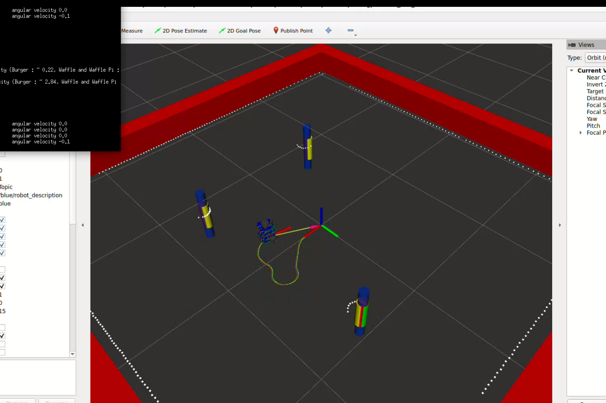
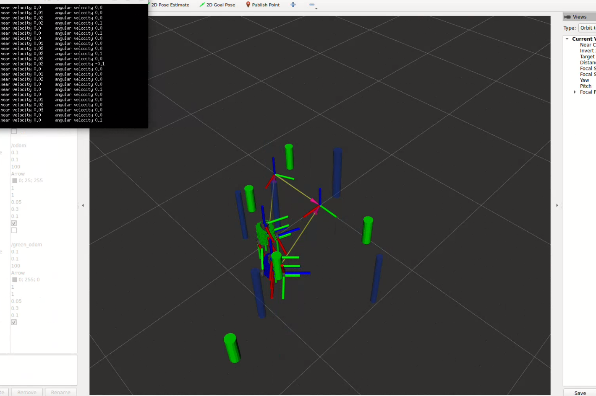

# ME495 Sensing, Navigation and Machine Learning For Robotics
* Ishaan Narain
* Winter 2022
## Package List
This repository consists of several ROS packages
- nuturtle_description - Package to visualize multiple turtlebots in rvis environment
- turtlelib - Package containing functions to assist with kinematics of diff drive robots
- nusim - Creates environments with turtlebots and cylindrical obstacles
- nucontrol - Allows for the control of turtlebots in simulation and real world environments
- nuslam - Implements a simultaneous localization mapping and machine learning with turtlebots in simulation and real life

## Simulation and Real Demo

### Simulation Demo

Video of Simulation Demonstration of SLAM with unknown data association:

https://youtu.be/QlarJMluz2w

Screenshot of Simulation Demonstration of SLAM with unknown data association:

### Real Demo

Video of Real Demonstration of SLAM with unknown data association:

https://youtu.be/eQ56fAfpJGk

Screenshot of Real Demonstration of SLAM with unknown data association: 

