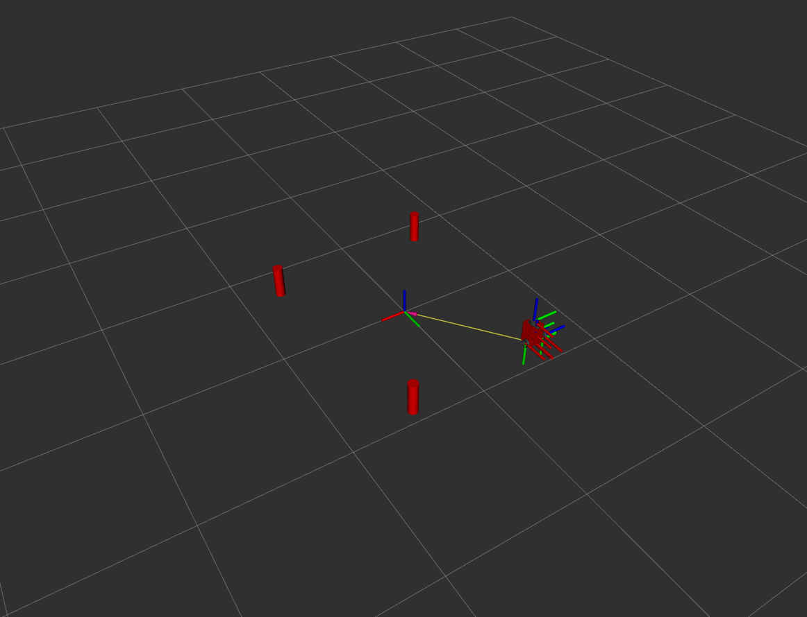
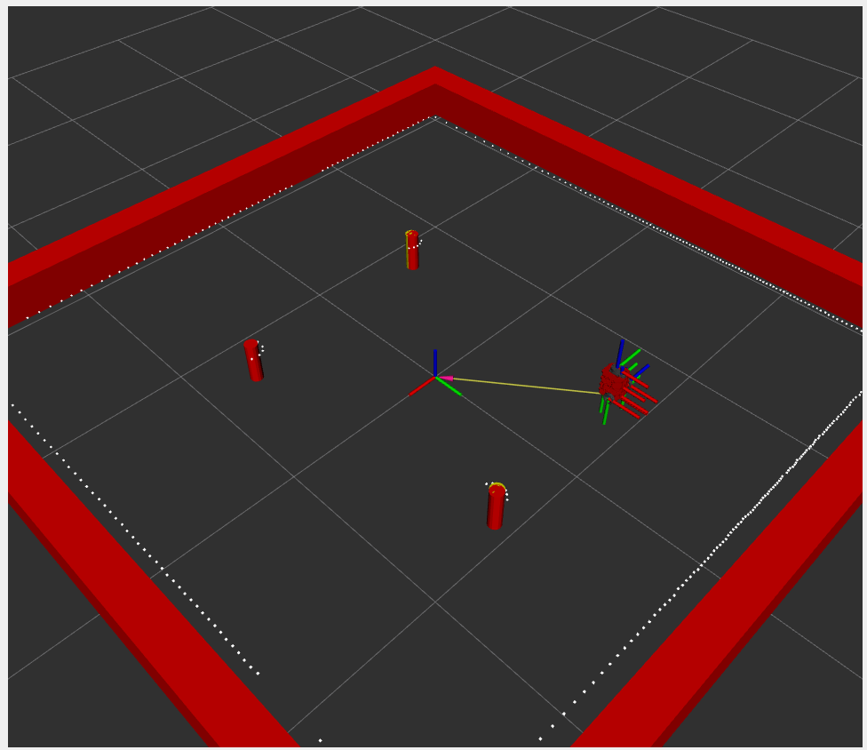

# Nusim
By Ishaan Narain

## Package Description
This package contains a node **nusim** which creates a simulation with a red turtlebot3 and obstacles, with services to teleport and reset the position of the robot.

## Launch Files
* `ros2 launch nusim nusim.launch.xml` to launch a red turtlebot in rviz with 3 obstacles, simulated sensor, and lidar

basic world configuration:

lidar simulation configuration:

## Parameters
Basic Parameters for the simulation environment including the turtlebot and the obstacles can be found in basic_world.yaml

1. `rate` - The frequency at which the main loop of the node runs
2. `x0` - The initial position of the turtlebot in x 
3. `y0` - The initial position of the turtlebot in y 
4. `w0` - The initial position of the turtlebot in theta 
5. `obstacles/x` - A list of the obstacles x-position 
6. `obstacles/y` - A list of the obstacles y-position 
7. `obstacles/r` - The radius of the obstacles
8. `x_length` - X length of arena wall
9. `y_length` - Y length of arena wall
10. `motor_cmd_per_rad_sec` - Motor Commands per Radians
11. `encoder_ticks_per_rad` - Radians per encoder tick
12. `input_noise` - zero mean Guassian noise with variance input_noise to commands
13. `slip_fraction` - Adding wheel slippage
14. `basic_sensor_variance` - Zero mean gaussian noise with variance added to obstacles
15. `max_range` - Max range of obstacle detection
16. `collision_radius` - Collision radius of robot object
17. `angle_max` - Max angle of lidar
18. `angle_min` - min angle of lidar
19. `angle_increment` - increment angle of lidar
20. `scan_time` - Scan time of lidar
21. `range_min` - Min range of lidar
22. `range_max` - Max range of Lidar
23. `draw_only` - Bool to check to draw fake obstacles

Worked With: N/A
