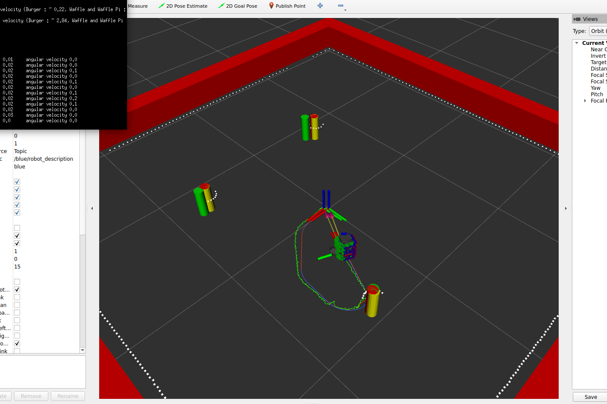

# NUSLAM
By Ishaan Narain

## Package Description
This packages contains 2 nodes for SLAM and a libraries for aan Extended Kalman Filter and Circle Regression
* NODE: `slam`: Publishes odometry and updated positions of robot and obstacles using sensor data
* NODE: `landmarks`: Uses circle regression to create circular landmarks using regression
* LIB: `ekf_slam`: Contains a library to carry out calculations for an extended kalman filter
* LIB: `circle_library`: Contains supervised and unsupervised techniques for circle classification and fitting

## Demonstration
### Simulation Demo

Video of Simulation Demonstration of SLAM with unknown data association:

https://youtu.be/QlarJMluz2w

Screenshot of Simulation Demonstration of SLAM with unknown data association:

### Real Demo

Video of Real Demonstration of SLAM with unknown data association:

https://youtu.be/V0X_N7h8JZE

Screenshot of Real Demonstration of SLAM with unknown data association: 

## Launch Files
* `ros2 launch nuslam nuslam.launch.xml` to launch a controller for the Turtlebot3, RVIZ simulation of EKF SLAM Robot (Green)
* `ros2 launch nuslam unknown_data_assoc.launch.xml` to launch a controller for the Turtlebot3, RVIZ simulation of EKF SLAM Robot with unknown data association
* `ros2 launch nuslam landmark_detection.launch.xml` to launch the landmark detection and circle fitting algorithm
* `ros2 launch nuslam turtlebot_bringup.launch.xml` to launch the numsr turtlebot3 locally and lidar (should only be used on Turtlebot3)
* `ros2 launch nuslam pc_bringup.launch.xml` to launch the slam, odometry,landmark, and control nodes for SLAM with Turtlebot3

nuslam launch output without data association for the launch file is shown here:

### nuslam.launch.xml - arguements:
* `cmd_src:=` - Source of input commands to the turtle controller node
    * `teleop` - Uses the Turtlebot3 teleop twist keyboard [default]
    * `none` - Any other method to publish to cmd_vel
* `robot` - Location of robot to run 
    * `nusim` - Start nusim node [default]
    * `none` - Any other robot
* `use_rviz` - Enable rviz simulation and red robot
    * `true`: Enable rviz [default]
    * `false`: Disable rviz

### unknown_data_assoc.launch.xml - arguements:
* `cmd_src:=` - Source of input commands to the turtle controller node
    * `teleop` - Uses the Turtlebot3 teleop twist keyboard [default]
    * `none` - Any other method to publish to cmd_vel
* `robot` - Location of robot to run 
    * `nusim` - Start nusim node [default]
    * `none` - Any other robot
* `use_rviz` - Enable rviz simulation and red robot
    * `true`: Enable rviz [default]
    * `false`: Disable rviz

### landmark_detection.launch.xml - arguements:
* `robot` - Location of robot to run 
    * `nusim` - Start nusim node [default]
    * `none` - Any other robot

## Config Parameters
Basic Parameters for the Slam library nodes

`slam`:
1. `body_id` - Name of body frame
2. `odom_id` - Name of odom frame
3. `wheel_left` - Name of left wheel joint
4. `wheel_right` - Name of right wheel joint
5. `x_init` - The initial position of the turtlebot in x 
6. `y_init` - The initial position of the turtlebot in y 
7. `theta_init` - The initial position of the turtlebot in theta 
8. `max_range` - Max range of obstacle detection
9. `obstacle_name` - Name of obstacle markers topic to subscribe to

`landmarks`:
1. `turtle_id` - Name of turtlebot for baseframe of landmark objects
2. `laser_name` - Name of laser topic to subscribe to

## SLAM Pose Results:

### Simulation Demonstration Pose
[nusim_node-6] sim x: 0.00510186, sim y: 0.00755007, sim rad: -6.37101
[slam-11] slam x: 0.01503504, slam y: 0.0174382, slam rad: -6.50894
[odometry-13] odom x: 0.0047845, odom y: 0.0100506, odom rad: -6.34481

### Real Demonstration Pose
[slam-7] slam x: 0.0552533, slam y: -0.0301833, slam rad: -3.13881
[odometry-11] odom x: 0.425253, odom y: 0.275451, odom rad: -1.09908

Note: I took this demo at 2:30 am, and forgot to reset the initial pose of the odom frame after it was slightly offset. I used the initial position of the odom robot to calculate the error. The green robot outperformed the blue robot.

It seems like the blue robot moves slower than the slam robot.

Worked With: Ayush, Ritika, Shan Tao

