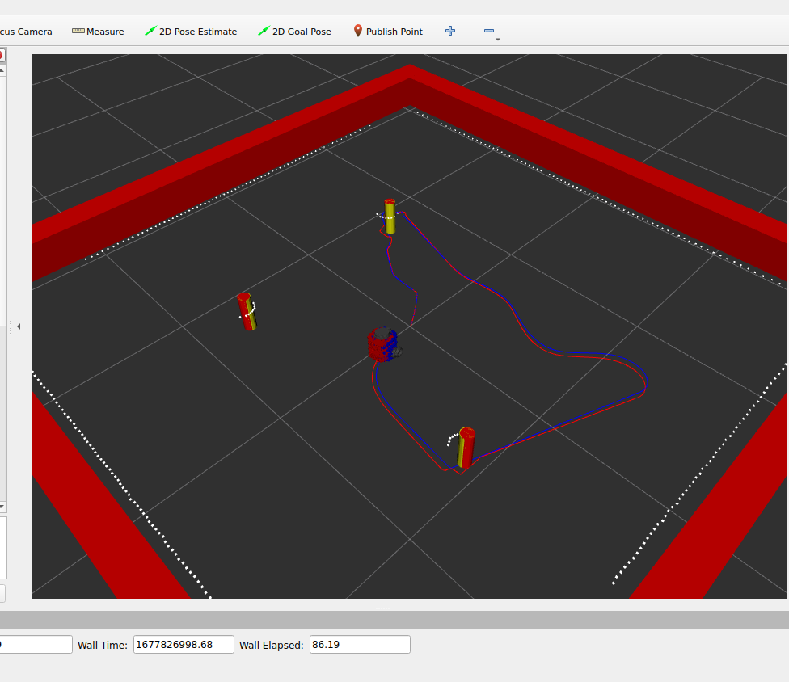

# NUTURTLE_CONTROL
By Ishaan Narain

## Package Description
This packages contains 3 nodes to control the Turtlebot3.
* `Turtle_control`: Node to help control the Turtlebot3
* `odometry`: Publishes odometry and updates simulated position of robot
* `circle`: Sends command velocity messages to make robot go in a circle

## Launch Files
* `ros2 launch nuturtle_control start_robot.launch.xml` to launch a controller for the Turtlebot3

Launch file video is linked here:
https://youtu.be/uFGFtILFuvU

nuturtle_control launch output for the launch file is shown here:

### Arguements:
* `cmd_src:=` - Source of input commands to the turtle controller node
    * `teleop` - Uses the Turtlebot3 teleop twist keyboard [default]
    * `circle` - Sends robot in a circle moving configuration
    * `none` - Any other method to publish to cmd_vel
* `robot` - Location of robot to run 
    * `nusim` - Start nusim node [default]
    * `localhost` - For odometry and turtle_control nodes to be run on the turtlebot
    * `none` - Any other robot
* `use_rviz` - Enable rviz simulation and red robot
    * `true`: Enable rviz [default]
    * `false`: Disable rviz [default]

## Config Parameters
Basic Parameters for the turtlebot3 controller for all 3 nodes:

`turtle_control`:
1. `rate` - The frequency at which the main loop of the node runs
2. `x0` - The initial position of the turtlebot in x 
3. `y0` - The initial position of the turtlebot in y 
4. `w0` - The initial position of the turtlebot in theta 
5. `obstacles/x` - A list of the obstacles x-position 
6. `obstacles/y` - A list of the obstacles y-position 
7. `obstacles/r` - The radius of the obstacles

`odometry`:
1. `body_id` - Name of body frame
2. `odom_id` - Name of odom frame
3. `wheel_left` - Name of left wheel joint
4. `wheel_right` - Name of right wheel joint
2. `x_init` - The initial position of the turtlebot in x 
3. `y_init` - The initial position of the turtlebot in y 
4. `theta_init` - The initial position of the turtlebot in theta 

`circle`:
1. `frequency` - The frequency at which the main loop of the node runs

## Example of Odometry Error
Header:
  stamp:
    sec: 1675922011
    nanosec: 692870666
  frame_id: odom
child_frame_id: blue/base_footprint
pose:
  pose:
    position:
      x: -0.02717665001790824
      y: -0.02569362066581205
      z: 0.0
    orientation:
      x: 0.0
      y: -0.0
      z: -0.7580740395395013
      w: -0.6521684986077315

Worked With: Nick Marks, Ayush, Ritika

