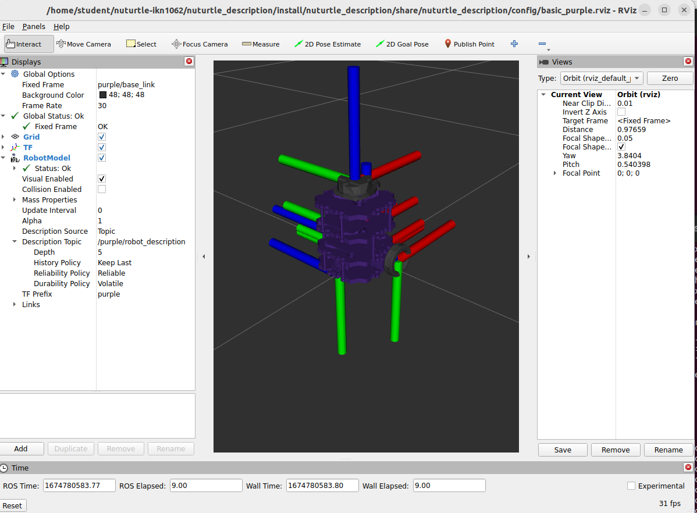
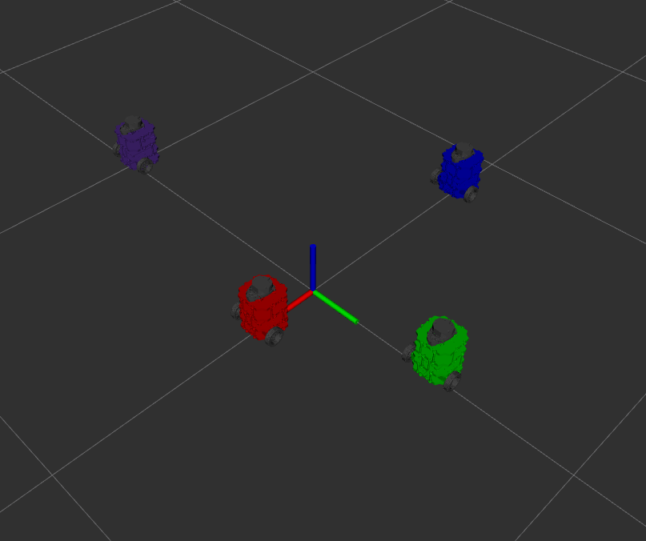

# Nuturtle  Description
URDF files for Nuturtle IshaanBot
* `ros2 launch nuturtle_description load_one.launch.py` to see the robot in rviz.
* `ros2 launch nuturtle_description load_all.launch.xml` to see four copies of the robot in rviz.

Load One Launch Example:

Load All Example:

* The rqt_graph when all four robots are visualized (Nodes Only, Hide Debug) is:

# Launch File Details
* `ros2 launch -s nuturtle_description load_one.launch.py `
  'use_sim_time':
    Whether to use simulation (Gazebo) clock if true [true/false]
    (default: 'false')

  'use_jsp':
      Whether to use joint_state_publisher [true/false]
      (default: 'true')

  'use_rviz':
      Whether to launch rvis2 [true/false]
      (default: 'true')

  'base_color':
      Select color for base [red,blue,green,purple]. Valid choices are: ['red', 'blue', 'green', 'purple']
      (default: 'purple')

  'r_frame':
      Name of the fixed frame in RVIZ.
      (default: '')

  'rviz_config_name':
      Set path to configuration based on base_color
      (default: 'basic_' + LaunchConfig('base_color') + '.rviz')

* `ros2 launch -s nuturtle_description load_all.launch.xml `
    Note: There are no arguements for load_all.launch.xml

Worked With: N/A
